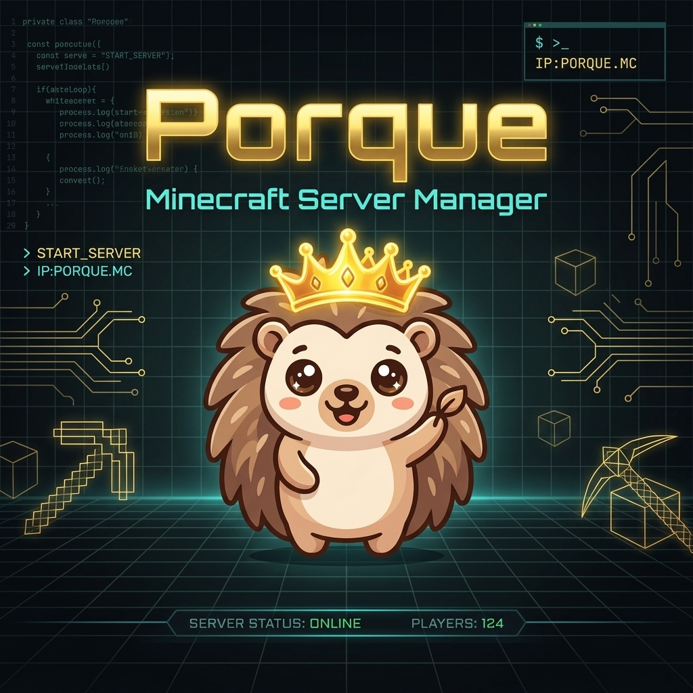

# <p align="center"></p>

# Porque 🦔
[](https://go.dev/)
[](https://wails.io/)
[](https://react.dev/)
[](https://sqlite.org/)

**Porque** (Spanish for *Why*, styled after our favorite crown-wearing chibi porquepine mascot) is a lightweight, premium, host-native desktop application designed to provision, orchestrate, and manage Minecraft servers.

Unlike heavy, Docker-dependent web dashboards, Porque runs directly on your host operating system. It manages Minecraft Java servers as native processes (`exec.Command`) and automatically wraps them in automated tunneling proxy services via Playit sidecars—making self-hosted gaming effortless.

---

## ✨ Features

*   **🎮 Host-Native Server Provisioning**
    *   Create Vanilla, Paper, Fabric, or Forge Minecraft servers directly on your machine.
    *   Configurable core allocations, custom RAM boundaries, and interactive RAM status warnings.
    *   Dropdown version picker for popular releases (1.21, 1.20.4, 1.12.2, etc.) and fallback support for custom/unreleased game jars.
*   **🔌 Fluid Mods & Plugins Grid**
    *   Drop `.jar` plugins or mods into an intuitive, drag-and-drop workspace.
    *   Dynamic card grid utilizing auto-filling responsive columns that adapt cleanly to any screen size without layout overflow.
*   **🌐 Instant Public Access (Playit Integration)**
    *   Expose local servers to the WAN instantly without port forwarding.
    *   Porque automatically pulls the native `playit` agent binary and hosts it alongside your game instance.
    *   Interactive tunnel statuses (mapping local IP, tunnel allocations, and connection state).
*   **📁 zero-Downtime Hot Backups**
    *   Trigger automated hot-backups while the server is online. 
    *   Porque coordinates console freeze commands over loopback TCP RCON, compresses the world volume, and verifies snapshots via SHA-256 validation.
*   **📊 Live Telemetry Console**
    *   Real-time stdout logging streamed directly over WebSocket connections.
    *   Visual telemetry tracking live process CPU usage, memory occupancy, storage space, and online player counts plotted with custom charts.

---

## 🛠️ Technology Stack

Porque is designed for visual excellence and optimal resource performance:

*   **Backend**: 
    *   [Go](https://go.dev/) (v1.21+) — Direct OS process spawning, TCP socket RCON management, and binary sidecar execution.
    *   [Wails v2](https://wails.io/) — Compact Go-to-JS bindings and secure desktop window integration.
    *   [SQLite](https://sqlite.org/) — Relational data engine powered by a pure-Go driver (`modernc.org/sqlite`).
*   **Frontend**: 
    *   [React](https://react.dev/) (v18) with TypeScript, built with [Vite](https://vite.dev/).
    *   [Tailwind CSS](https://tailwindcss.com/) for fluid, modern dark-mode styling.
    *   [Recharts](https://recharts.org/) for live resource tracking charts.
    *   [Radix UI](https://www.radix-ui.com/) primitives for premium interactive components.

---

## 🚀 Getting Started

### Prerequisites

To build and run Porque locally, ensure your Windows host has the following:

1.  **Go (v1.21+)**: Ensure `go version` works in your shell.
2.  **Node.js (v18+)** & **npm**.
3.  **C Compiler (gcc)**: Wails relies on CGO. Install via [MSYS2 / MinGW-w64](https://www.msys2.org/) and add `gcc` to your system `%PATH%`.
4.  **Wails CLI**: Install by running:
    ```bash
    go install github.com/wailsapp/wails/v2/cmd/wails@latest
    ```

### Development

Run Wails in hot-reload mode. This compiles the backend, runs Vite in the frontend, and mounts them inside a desktop webview:

```bash
wails dev
```

### Production Build

To build a standalone, optimized Windows executable (`.exe`) with the custom porquepine mascot icon embedded:

```bash
wails build
```

---

## 📄 License
This project is proprietary. Minecraft is a trademark of Mojang Synergies AB.
